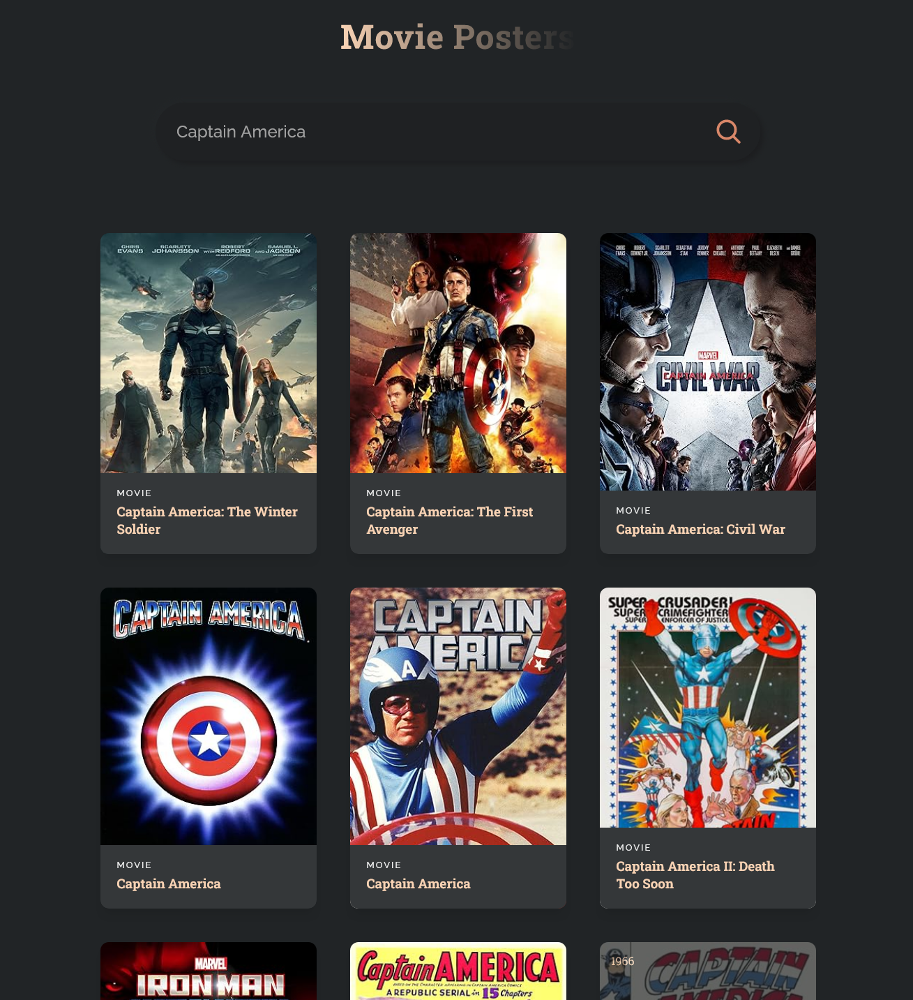
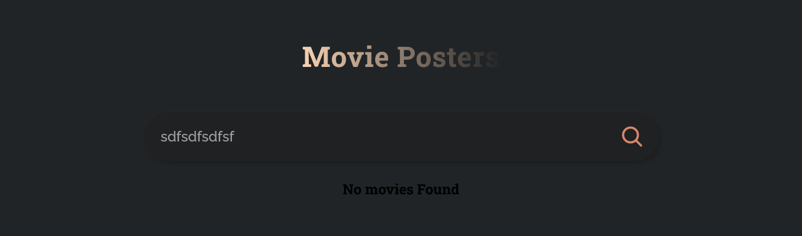

# Movie Title Fetcher with React.js

## Project Overview

This project is a simple React.js application that integrates with the [OMDb API](http://www.omdbapi.com/) to fetch and display movie titles. Users can search for movies using keywords, and the app will display relevant results including movie posters, titles.

### Features

- **Search Functionality**: Allows users to search for movies using keywords.
- **API Integration**: Fetches movie data from the OMDb API.
- **Responsive Design**: Ensures the app looks good on both desktop and mobile devices.
- **Error Handling**: Gracefully handles and displays errors (e.g., movie not found).

Screenshots

